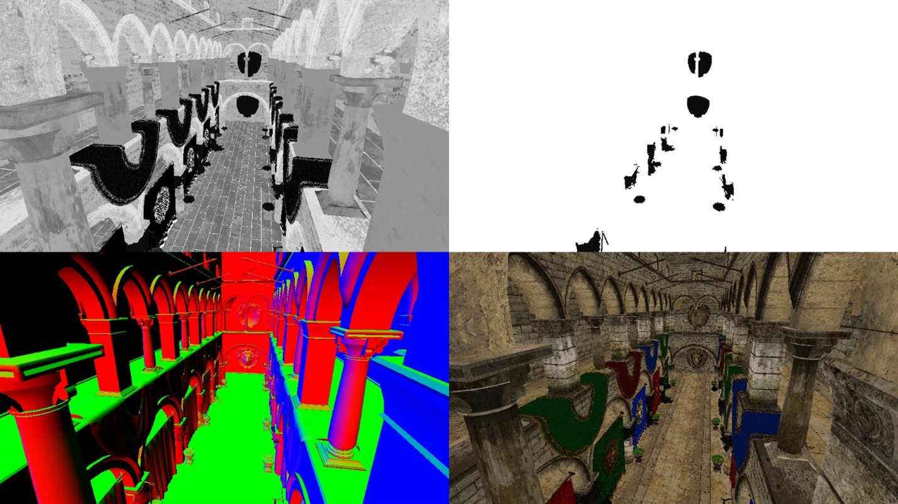
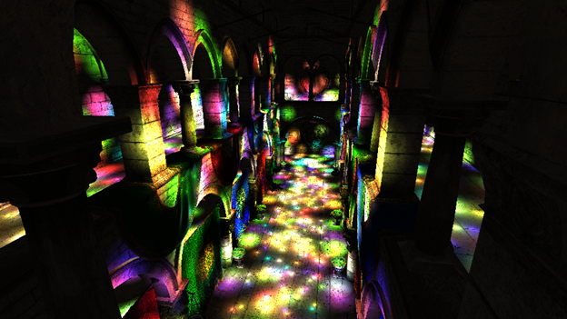
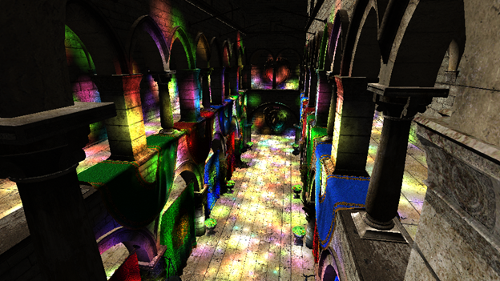
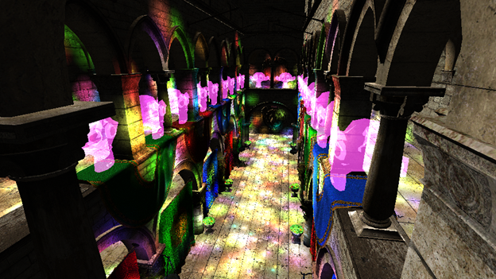
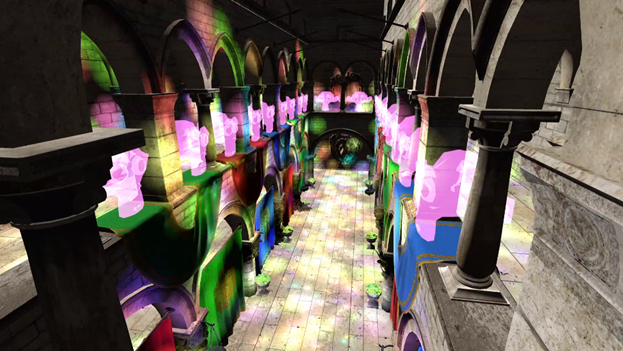

## What is this all about?

This is a self-study project that implements deferred lighting as core of rendering pipeline, with support for physically based rendering (PBR). The renderer is written in C++ for the PS5 using a low-level **Prospero** API.

This project was undertaken as part of a university course assignment aimed at deepening expertise in a desired topic. I chose to focus on exploring new methods to optimize the renderer and delving deeper into low-level graphic APIs.

> The project codebase cannot be shared due to protection of NDA rules!
{: .prompt-warning}

This blog post will delve into the main technical details of the project and share the insights I gained from it.

## Philosophy of deferred

I found that the fundamentals of deferred pipeline are commonly used in modern games. This technique leverages memory to optimize light calculations. Modern GPUs provide ample memory to support such methods, even for 4K gameplay at a nice framerate.

The core concept of the algorithm is to separate the entire rendering process into 3 passes – [geometry](#geometry-pass), [lighting](#lighting-pass) and [final](#final-pass). Additionally, I incorporated a [transparent](#transparency-pass-personal-addition) and [direct light](#direct-light-pass) passes into the pipeline, just as a stretch goal.

## The pipeline

### Geometry pass
First, we render world geometry into multiple render targets and the rendered information is stored in so called **Geometry Buffers** *(later GBuffers)*. This results in having several full-screen textures with all the information, where every pixel stores the information required for light calculations.

> The best practise is to store all the data in the least number of buffers as possible. I stored the data in the following order.\
> <u>Be mindful about data types (uint or float) when creating your own buffers!</u>
>
> |  | Slot1 | Slot2 | Slot3 | Slot4 |
> | ------ | ----- | ----- | ----- | ----- |
> | **Buffer A** | NormalX | NormalY | NormalZ | Roughness |
> | **Buffer B** | DiffuseR | DiffuseG | DiffuseB | Metallic |
{: .prompt-info}

```glsl
struct V2P
{
	vec4 S_position         : S_POSITION;
	vec4 World_position     : WORLDPOS;
	vec3 Normal             : NORMAL0;
	vec2 UV                 : TEXCOORD0;
	mat3x3 TBN;
};

GBufferOutput main(V2P input)
{
	GBufferOutput outBuffers;

	outBuffers.A_buffer = vec4(GetNormals(input), GetRoughness(input));
	outBuffers.B_buffer = vec4(GetDiffuse(input), GetMetallic(input));

	return outBuffers;
}
```
{: file='Pixel shader'}

It enables us to overwrite all the initial values at the beginning of the frame, saving time from all wasteful light calculations (compared to a forward renderer).


*As a result, 4 separate textures: roughness; metallic; normal; diffuse*

### Lighting pass
One more trick to save the performance is to pass light sources as spheres to the vertex shader. Then, use the vertex data to obtain screen coordinates in the fragment shader, which are then utilized as UV input for GBuffers (full-screen textures).

```glsl
struct V2P
{
	vec4 screen_position       : S_POSITION;
	int light_index;
};

Buffer<PointLightData> point_lights;

V2P main(VS_INPUT input, uint lightID : S_INSTANCE_ID)
{
	V2P output;
	output.light_index = lightID;
	output.position = mul(mul(mul(camera.projection, camera.view), point_lights[lightID].transform), float4(input.position, 1.0));
	return output;
}
```
{: file='Vertex shader'}

```glsl
Texture2D A_buff;        // Normal.xyz, Roughness
Texture2D B_buff;        // Diffuse.rgb, Metallic
Texture2D depth_buff;    // Depth

Buffer<PointLightData> point_lights;

vec4 main(V2P input)
{
	// This is a perspective devide (cold be found in any book of graphics in the first chapter)
	// The hardware does this divide automatically when calculating the fragment location on the screen
	vec2 screen_coords = input.screen_position.xy / input.screen_position.w;

	// Changes coordinate frame from [-1;1] to [0; 1]
	screen_coords = (screen_coords + vec2(1.0)) / 2.0f;
	
	// Flips the vertical coordinate
	// This is specific to char (normalized device coordinates)
	screen_coords.y *= -1;

	vec4 A_input = A_buff.Sample(samp, screen_coords);
	vec4 B_input = B_buff.Sample(samp, screen_coords);
	float position = CalcPositionFromDepth(depth_buff.Sample(samp, screen_coords), screen_coords.xy);

	PointLightData point_light = point_lights[input.light_index];

	return PointLightPBR(
		// Here is your input for color calculations
	);
}
```
{: file='Pixel shader'}

This principle significantly accelerates light calculations, as we only operate on pixels affected by light. The image below shows light sources as transparent spheres, so that we can see what pixels are affected by which light source.

*Lights visualized as transparent spheres*

> In this explanation I focused only on point lights. For spot lights the same approach can work as well, but cones might a better fit to it.
{: .prompt-tip} 

This approach ensures that we have all the essential information required to calculate light at a specific pixel. The calculated data is blended with a fifth buffer called **Light Accumulation** or **Accumulation buffer**.


*For now, that is how the light accumulation buffer will look like*

### Direct light pass
In virtual worlds, we encounter various types of light, with point and direct lights being the most common. Direct light sources influence the entire scene, illuminating everything from the same angle.

In this scenario, there is no need for optimization as in the lighting pass, so we straightforwardly traverse every pixel and assess the resulting color.


*One direct light source illuminated the scene.*

### Transparency pass (personal addition)
By default, transparency is not handled in this pipeline (later will be discussed why). The way I implemented is pretty simple – I project model onto the screen and multiply the opacity coefficient with a base color texture. Nothing else.


*Some transparent objects drawn in the Accumulation buffer*

### Final pass
In this stage, you might perform some post-process and finally render the image on the screen. I simply added an ambient light to the scene. Typically, we just extract the pixel data from Light accumulation buffer and display it on the screen.


*I added an ambient light to the final outcome*


## Weighing 
As a result, we see improvements in light interactions with the world. Smaller lights incur smaller performance costs. However, this comes at the expense of increased memory usage. Thankfully nowadays, VRAM / SMEM is not such a big deal. Despite its optimizations, the deferred renderer faces two common disadvantages, which programmers must overcome with distinct solutions themselves:

- **Anti-Aliasing**\
In the geometry buffers, only precise data is stored, interpolation in this algorithm is not possible. Otherwise, values for light computations would lead to artifacts.

- **Transparent objects**\
GBuffers store only the foreground of what you see, and if new data is closer to the camera than the older one, it will overwrite previous values.


## Impressions
The challenges I overcame, the knowledge I gained, the feedback I have received… were enormous. This project was solely mine; no one else on my course was working on the same thing. Many aspects of my project were unique to me, especially coding on low-level API that cannot be found in the internet.

Thanks for reading this. GG


*This project was part of university course*