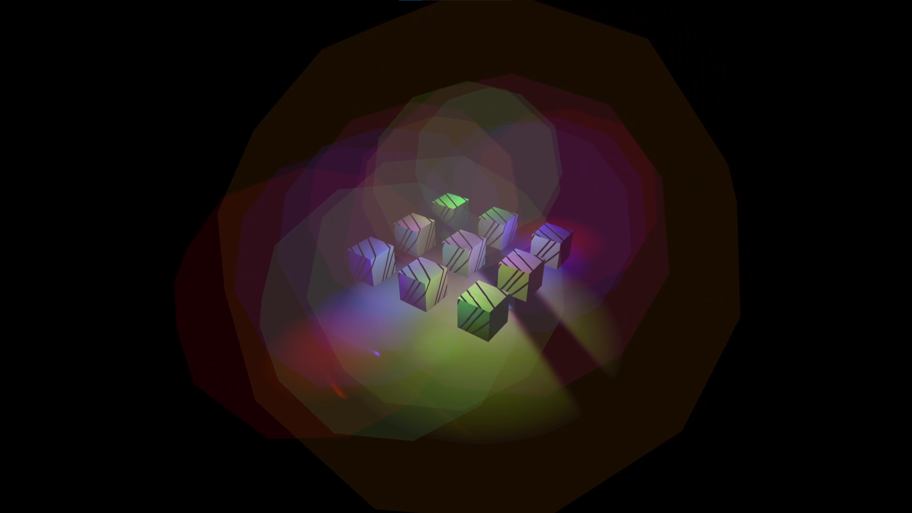

## General infromation

This is a self-study project that implements deferred lighting as core of rendering pipeline, with support for physically based rendering (PBR). The renderer is written in C++ for the PS5 using a low-level **Prospero** API.

This project was undertaken as part of a university course assignment aimed at deepening expertise in a desired topic. I chose to focus on exploring new methods to optimize the renderer and delving deeper into low-level graphic APIs.

> The project codebase cannot be shared due to protection of NDA rules!
{: .prompt-warning}

## Features of the project

- Deferred lighting pipeline
- Physically based renderer
- Hundreds of light sources with playeable framerate
- The project is implemented for PlayStation

## Screenshot

On this image you can see transparent spheres. Those spheres are actual light sources, and volume that they illuminate.

> I wrote an [article](/posts/Deferred_renderer_article) about how it works. More details about the project is there.
{: .prompt-tip}