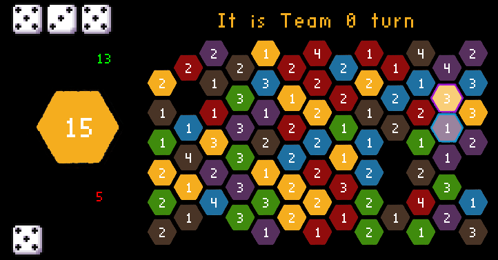

## General information

This project has been made for a local gam jam at [my university](https://www.buas.nl/). The idea was to make a game that uses hexagonal math.
My goal was to re-create a dice wars game that I have played a lot in my childhood.

[Bojan Endrovski](https://www.linkedin.com/in/bojanendrovski/) was leading the game jam and lessons about hexagons.

## Features of the project

- Multiplayer on one PC
- Computer can be a player
- Random map every new game

> Check out the [GitHub](https://github.com/SmailikHappy/Hex_dice_wars) repo with this project for more information
{: .prompt-tip}

___

*Screenshot from the game*