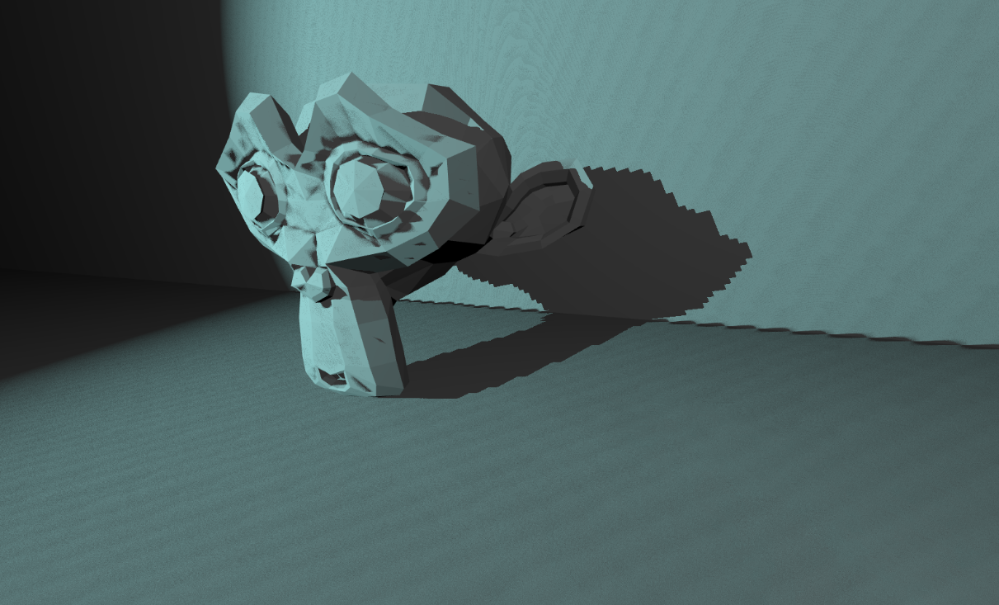
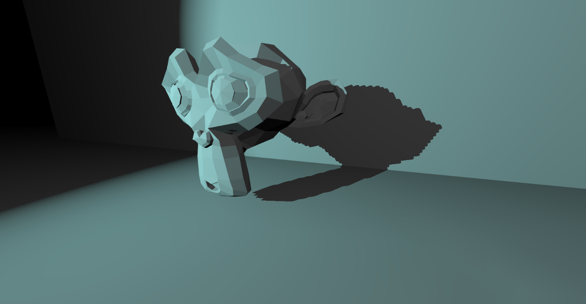
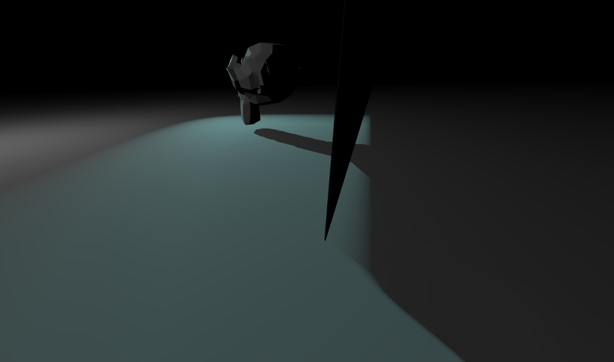
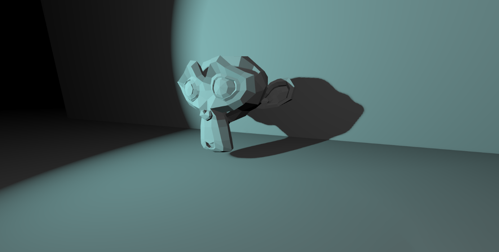
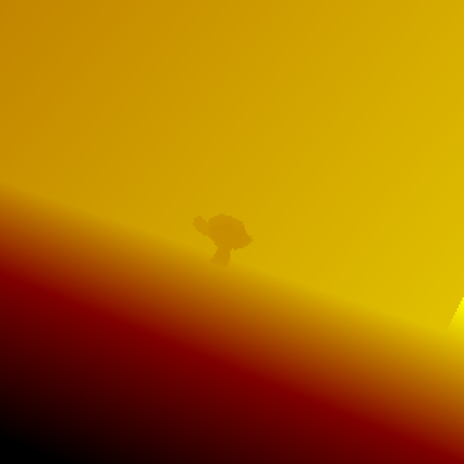
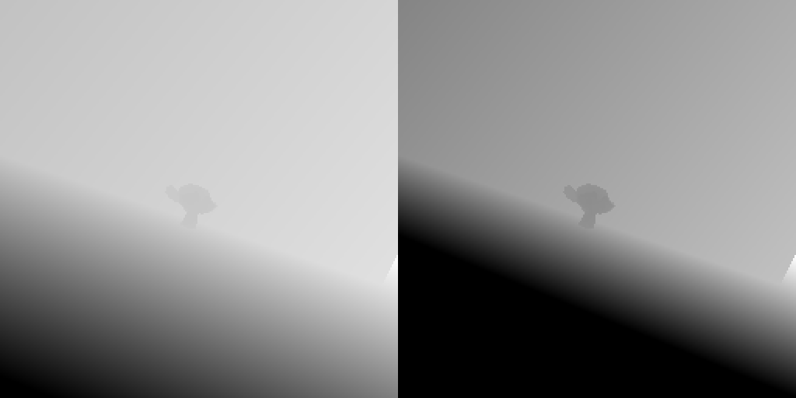
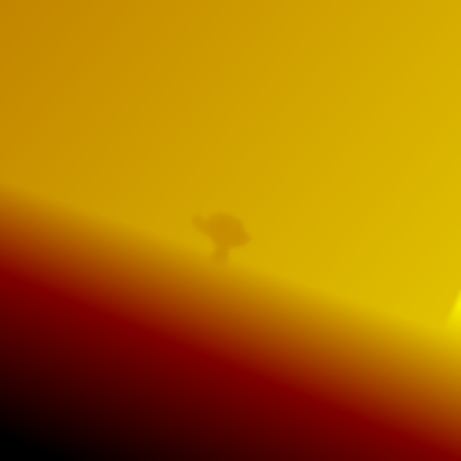
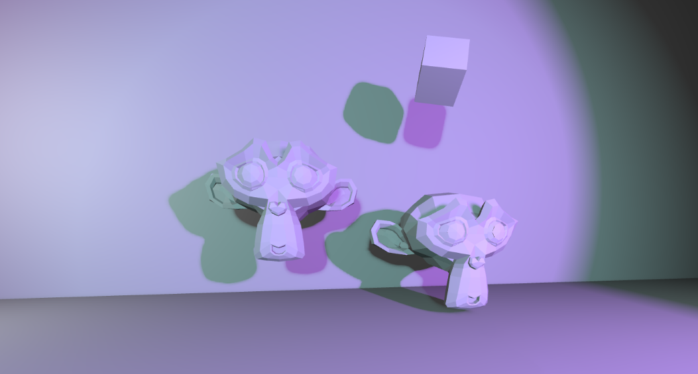

## What is this all about?

During my second year at [university](https://www.buas.nl/), we were divided into groups tasked with creating a custom engine that might be used to develop a game in the last quarter of the year.

As the graphics programmer for my team, I was responsible for implementing shadows. In this article, I will explain why I chose variance shadow maps and how they function.

> It would be helpful if you already have a basic understanding of light and shadow mapping algorithms.
{: .prompt-warning}


## Why variance shadow maps

### Initial situation

I started by implementing basic shadow mapping with some additional smoothing techniques. However, the results were disappointing: the shadows looked pixelated and shadow acne was the most annoying problem to face.

*The image shows The Suzanne casting a pixelated shadow, and shadow acne is visible all over the wall, floor, and Suzanne itself.*


*Spot light illuminates the Suzanne.*

### Shadow bias

There is a simple workaround to fix a shadow acne - biasing the shadow map.
```glsl
float bias = 0.005;
float shadow = currentDepth - bias > closestDepth ? 1.0 : 0.0;
```


*Bias added to the shadow map, resolved the shadow acne.*

### Light bleeding

While using bias can resolve shadow acne, it highlights another issue — light bleeding. For very thin surfaces, the bias offset can cause shadows to shift, leading to light leaking in between the edges of the geometry.


*Thin wall next to Suzanne, casts a shadow with some light bleed at the bottom.*

### Variance shadow maps

After spending some time researching, I decided to use a more advanced shadow mapping algorithm, which offers efficient filtering, cheap edge softening, and a better solution to the biasing problems associated with standard shadow maps.


*Variance shadow mapping with the same shadow map resolution.*


## The pipeline

### Generating buffers & shadow maps

A shadow map is a texture containing light-view information, which is essentially the depth information of how far the light has reached.

> Algorithm to draw the shadow map is in the [next section](#shadow-pass--render-shadow-maps)
{: .prompt-info}

Typically, we would use only depth textures, but this algorithm requires to store 2 float values per pixel - depth and depth squared with partial derivatives. Consequently, the texture will have 2 channels.

> You need to store the squared depth because you can't recalculate it after the filter pass; the math behind this will be [explained later](#why-we-cannot-recalculate-the-values-after-the-filter-pass).
{: .prompt-warning}

The size and number of shadow maps used per light source depends on the developer's choice. In my particular case, I used one large texture for the directional light, one small texture for the spot light, and a small cube texture for the point light. Coloured shadows are not taken into account in this implementation.


### Shadow pass / render shadow maps

Now, we are doing the same as all shadow mapping algorithms. We will render the scene from a light's point of view, which is similar to how a camera works. In this case, we are only interested in the depth information. The camera settings are unique per light type:

**Directional light**:
- Uses orthographic projection
- The *camera* is positioned far away from the center of the scene (or the player), so that all objects that can occlude are within the light's viewing frustum.
- The *camera* direction is the same as the light's direction

**Spot light**:
- Uses perspective projection
- The *camera* is located at the spot light's position
- The perspective FOV angle matches the light's angle
- The *camera* faces the same direction as the light

**Point light**:
- Uses 6 perspective projections to render a cube texture
- The *camera* is positioned at the point light's location
- The perspective FOV angle is 90° for each face of the cube texture.

> I recommend you [this beginner tutorial from OGLDEV](https://youtu.be/uhCbfZ_L7uc?si=f9bDW9sbryrW3Tsx) that explains how to render shadow maps for point light sources. There are some nuances.
{: .prompt-tip}

Once all the necessary parameters have been set, we pass the scene mesh data and render it to the shadow map.

```glsl
void main()
{
    mat4 object_matrix = object_transforms[gl_InstanceID].world;
    vec4 position = light_matrix * object_matrix * vec4(a_position, 1.0);

    gl_Position = position;
}
```
{: file='Vertex shader'}

```glsl
void main()
{
	float depth = gl_FragCoord.z;
	float moment1 = depth;

	float dx = dFdx(depth);
	float dy = dFdy(depth);
	float moment2 = depth * depth + 0.25 * (dx*dx + dy*dy);

	frag_color = vec4(moment1, moment2, 0.0f, 0.0f);
}
```
{: file='Pixel shader'}

> By computing the partial derivatives `dx` and `dy`, you get an estimate of the depth gradient. Squaring these derivatives and adding them into the second moment calculation helps capture how quickly the depth is changing.
{: .prompt-info}


*Amplified result of our shadow map from the example above*


*both channels separately: left - depth, right - depth squared; <u>the right one is clamped for showcase purposes</u>*


### Filter pass (blurring)

In this pass, we need to blur the shadow map values. I have used a [Gaussian blur](https://en.wikipedia.org/wiki/Gaussian_blur) algorithm in my case. This algorithm is applied twice - horizontally and vertically.

Input for the filter pass is fullscreen quad.\
Output is a shadow map (texture as a render target).

```glsl
out vec2 v_uv;

void main()
{
	gl_Position = vec4(a_position, 1.0f);
	v_uv = a_uv;
}
```
{: file='Filter vertex shader'}

```glsl
void main()
{
	vec4 pixelColor = vec4(0.0f);

	vec2 finalUV[7];
	uint i = 0;

	for (float offset = -3.0; offset <= 3.0; offset += 1.0f)
	{
		finalUV[i++] = clamp(v_uv + offset * u_blurScale, float2(0.0f), float2(1.0f));
	}
	
	pixelColor += texture(raw_shadowMap, finalUV[0]) * (1.0f / 64.0f);
	pixelColor += texture(raw_shadowMap, finalUV[1]) * (6.0f / 64.0f);
	pixelColor += texture(raw_shadowMap, finalUV[2]) * (15.0f / 64.0f);
	pixelColor += texture(raw_shadowMap, finalUV[3]) * (20.0f / 64.0f);
	pixelColor += texture(raw_shadowMap, finalUV[4]) * (15.0f / 64.0f);
	pixelColor += texture(raw_shadowMap, finalUV[5]) * (6.0f / 64.0f);
	pixelColor += texture(raw_shadowMap, finalUV[6]) * (1.0f / 64.0f);

	frag_color = vec4(pixelColor.xy, 0.0f, 0.0f);
}
```
{: file='Filter pixel shader'}


*Amplified result of the blur of the shadow map*


*both channels separately: left - depth, right - depth squared; <u>the right one is clamped for showcase purposes</u>*

#### Why we cannot recalculate the values after the filter pass?

Squared sum is not equal to sum of squares. The filter pass is mixing both texture channels from different pixels in parallel multiple times. So you cannot simply recalculate the values from depth only after the filter pass.

$$ (a+b)^2 \neq a^2 + b^2 $$

$$ a^2 + 2ab + b^2 \neq a^2 + b^2 $$

$$ 2ab \neq 0 $$

while $ a \neq 0 $ or $ b \neq 0 $.


### Render pass

When the render pass is called, we need to reproject the screen pixel to the light space coordinates and calculate the depth in light frustum space.
This `compareDepth` value is the screen pixel depth value in light space coordinates.

```glsl
float CalcShadowSpotFactor(uint light_index)
{
    vec4 lightSpacePos = spot_lights[light_index].shadow_matrix * vec4(v_position, 1.0f);

    vec3 proj_coords = lightSpacePos.xyz / lightSpacePos.w * 0.5f + 0.5f;
    vec2 uv;
    uv = proj_coords.xy;
    float compareDepth = proj_coords.z;

    return SampleVarianceShadowMap(s_shadow_spot_maps[light_index], uv, compareDepth, c_spotVarianceMin, c_spotLightBleedReductionAmount);
}
```
{: file='Render pixel shader'}

After all the values are calculated, the shadow map is sampled to determine the shadow factor. This is achieved using the `SampleVarianceShadowMap()` function in my implementation.

In the basic shadow mapping algorithm, if the `compareValue` is greater than the sampled depth value from the shadow map, it means that the light did not reach the pixel and is therefore shadowed. In the Variance shadow mapping, we perform additional variance calculations to make the shadows softer.

- `shadowMap` - The shadow map texture to sample
- `coords` - The texture coordinates (UVs) to sample the shadow map at
- `compareValue` - The depth value to compare with the shadow map
- `varianceMin` - The minimum allowed variance (to avoid division by zero)
- `lightBleedReductionAmount` - The amount of light bleed reduction to apply

```glsl
float linstep(float low, float high, float v)
{
	return clamp((v-low) / (high-low), 0.0f, 1.0f);
}

float SampleVarianceShadowMap(sampler2D shadowMap, vec2 coords, float compareValue, float varianceMin, float lightBleedReductionAmount)
{
	vec2 moments = texture(shadowMap, coords.xy).xy;

	float p = step(compareValue, moments.x);
	float variance = max(moments.y - moments.x * moments.x, varianceMin);
	
	float d = compareValue - moments.x;
	float pMax = linstep(lightBleedReductionAmount, 1.0, variance / (variance + d*d));
	
	return min(max(p, pMax), 1.0);
}
```
{: file='Render pixel shader'}

> In Variance Shadow Mapping, two moments are used to calculate the variance of the depth values. This variance makes the shadows softer using [Chebyshev's inequality](https://en.wikipedia.org/wiki/Chebyshev%27s_inequality).
{: .prompt-info}

> The values I used for OpenGL
>
```glsl
const float c_directLightBleedReductionAmount = 0.6f;
const float c_directVarianceMin = 0.000002f;
const float c_spotLightBleedReductionAmount = 0.9997f;
const float c_spotVarianceMin = 0.0000004f;
const float c_pointLightBleedReductionAmount = 0.997f;
const float c_pointVarianceMin = 0.000009f;
```
{: .prompt-tip}


## Weighing 

While this solution isn't perfect, it significantly improves the issues I addressed. The shadow acne is eliminated, shadows appear less pixelated, and the performance is comparable to simple shadow mapping. However, the shadows are sometimes too soft for sharp objects, which can be adjusted by tweaking the `varianceMin` and `lightBleedReductionAmount` parameters.


*2 spot lights illuminating Suzannes and a cube*

Should everyone use this algorithm? I don't know. But at the moment, I suggest everyone first to dive into [Cascaded Shadow Mapping](https://c4engine.com/wiki/index.php?title=Cascaded_Shadow_Mapping) and to see how that one works for them. Then, think about other approaches to improve the quality of shadows. Variance might not be the best or suitable solution.


## Impressions

This was an interesting challenge to tackle. It was completed quickly and within a short period of time. Whe the task was completed, I realized it was not essential for the team project at all and I should have focused on other things. But it was a valuable learning experience, I always wanted to code shadows in a game.

Thanks for reading this. GG


*This project was part of university course*