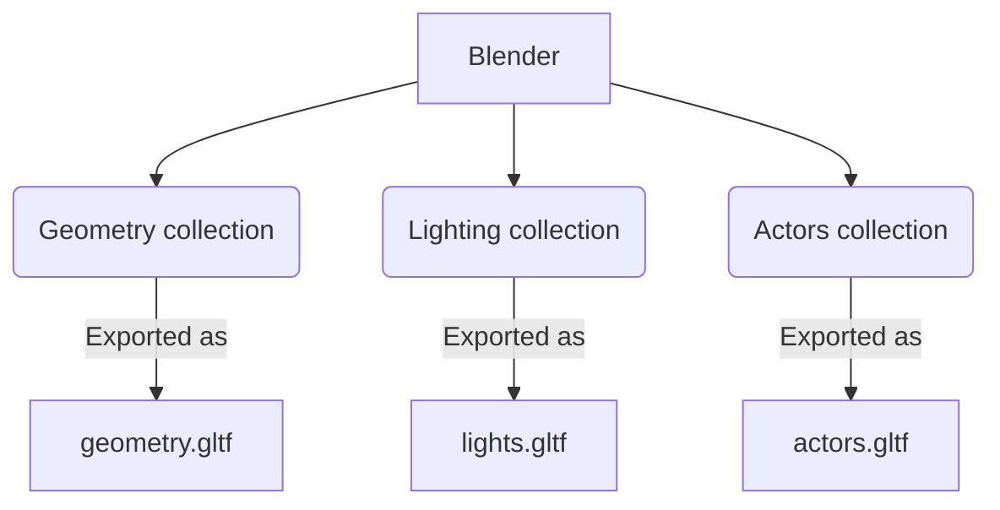
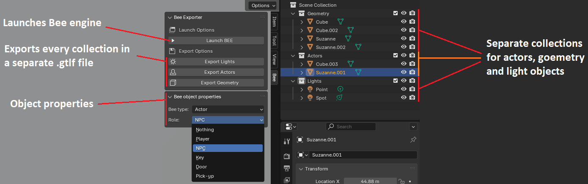
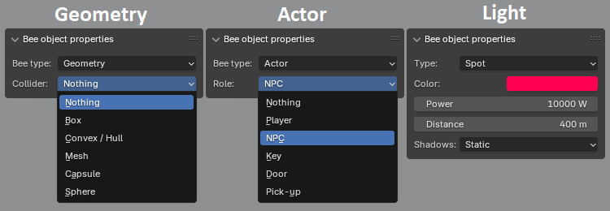

## What is this all about?

During my second year at [Breda University](https://www.buas.nl/), we had a group task to create custom cross platform engine. As a group, we decided to use blender as our main level editor. Me and [Mark Follinus](https://www.linkedin.com/in/mark-follinus-0b5b5a188/) were working on Blender script together for a few weeks.

This article explains some of the script details and a pipeline we established in our engine.

> **Bee** is the name of the engine we worked on
{: .prompt-info}

## A short video showcasing the plugin

*On this video you can see a small example of blender being used as level editor.*

<video class="w-100" controls>
  <source src="/assets/post_data/blender_as_level_editor/blender_to_bee.mp4" type="video/mp4">
</video>


## Object structure



All the world objects are split in three different collections - Geometry, Lighting and Actors. Each collection is exported to a separate file, that is then loaded by the engine in three different ways.

- **Geometry** - meshes that are always static, they can have colliders
- **Actors** - game entities with script that defines their behaviour.\
  *(e.g. NPC that should approach a player or a key that will open a door)*
- **Lighting** - light sources from the scene

## Buttons and parameters for the user

The user has two panels to operate:
- [**Bee exporter**](#bee-exporter)
- [**Object properties**](#object-properties)



### Bee exporter

#### Launch engine button

Code below implements a functionality for the `Launch engine` button.\
It simply executes the engine's executable. The only requirement is that a user has to specify the path to the engine's executable and launch arguments at the beginning of the script.
```py
# Open the executable from within project root folder...
path = "C:/Projects/2324-Y2C-PR-FPS"
# In the engine it defines the exact project folder data to launch
args = ["gym_dani"]

def launch():
    subprocess.Popen([path+"/bin/x64_Release/application/application.exe"]+args, cwd=path)
     
class launcher(bpy.types.Operator):
    bl_idname = "object.custom_operator_launcher"
    bl_label = "Launch BEE"
    def execute(self, context):
         launch()
         return {'FINISHED'}
```

#### Export \<collection\> button

The code below is responsible for the `Export geometry` button.
When the button is clicked, it looks for a collection named "Geometry" and exports it to as a `<project name>_geometry.gltf`{: .filepath}, meanwhile setting the export parameters.

```py
class exporter_geometry(bpy.types.Operator):
    bl_idname = "object.custom_operator_exporter_geometry"
    bl_label = "Export Geometry"
    def execute(self, context):
         export_geometry_gltf()
         return {'FINISHED'}

def export_geometry_gltf():
    # Find the collection by the name
    collection_name = "Geometry"
    collection = bpy.data.collections.get(collection_name)

    # Select the collection
    bpy.context.view_layer.active_layer_collection = bpy.context.view_layer.layer_collection.children[collection.name]
    
    # Export only selected collection of objects
    bpy.ops.export_scene.gltf(filepath=(path+"/assets/models/geometry/"+name+"_geometry"),
                              check_existing=(True),
                              gltf_export_id=("Geometry"),
                              export_format=('GLTF_SEPARATE'),
                              export_image_format=('AUTO'),
                              export_texture_dir=("../../textures/"+name+"/geometry/"),
                              use_active_collection=(True),
                              export_tangents=(True),
                              export_extras=(True),
                              export_yup=(False),
                              export_lights=(True))
```

### Object properties



Every blender object has its own property panel to configure object's settings:
- *If it is a geometry*, it will have an option to choose a collider.
- *If it is an actor*, it will have an option to choose a behavior script.
- *If it is a light*, it will have an option to choose a light type and expose some essential light parameters.

> We are using blender mesh instances for both geometry and actor objects. That's why we have **Bee type** dropdown menu. For lightsources we use blender light instances.
{: .prompt-info}

The code below shows how the panel is created:\
As you can see from the `draw()` function, depending on the object type, different properties are exposed to the user.

```py  
class panel_object_properties(bpy.types.Panel):
    bl_label  = "Bee object properties"    # Drop down label  
    bl_idname = "panel_object_property"    # Internal ID
    bl_space_type  = 'VIEW_3D'             # Which window the panels should appear
    bl_region_type = 'UI'                  # Where in the window should the panel appear
    bl_category = 'Bee'                    # Tab label
    
    def draw(self, context):
        layout = self.layout
        obj = context.object
        
        # Light object is selected
        if obj.type == 'LIGHT':
            light = obj.data
            
            row = layout.row()
            row.prop(obj, "light_type")
            row = layout.row()
            row.prop(light, "color", text = 'Color')
            row = layout.row()
            row.prop(light, "energy", text = "Power")
            row = layout.row()
            row.prop(light, "cutoff_distance", text = "Distance")
            row = layout.row()
            row.prop(obj, "shadow_cast_type")
            
        # Mesh object is selected
        if obj.type == 'MESH':
            mesh = obj.data
            
            row = layout.row()
            row.prop(obj, "bee_type")
            
            # Actor type is selected
            if obj.bee_type == 'Actor':
                row = layout.row()
                row.prop(obj, "bee_actor_type", text = "Role")
                
                if obj.bee_actor_type == 'Key' :
                    row = layout.row()
                    row.prop(obj, "bee_door_id", text = "Door ID")
                    
                if obj.bee_actor_type == 'Door':
                    row = layout.row()
                    row.prop(obj, "bee_door_id", text = "Door ID")
                
            # Geometry type is selected
            elif obj.bee_type == 'Geometry':
                row = layout.row()
                row.prop(obj, "bee_collider_type", text = "Collider")
```

Below is the actor type enum. Different actor types have different behavior scripts.\
Function `update_bee_actor()` is called when the actor type enum is changed using the dropdown menu. This function actually updates the object's custom property data (in this case `ActorType` value), which later is exported with the object's data.\
The enum definition is starting from line 26.

```py
def update_bee_actor(self, context):
    obj = context.object
    actor_type = obj.bee_actor_type
    
    if actor_type == 'Player':
        obj.data['ActorType'] = 0
    elif actor_type == 'Agent':
        obj.data['ActorType'] = 1
    elif actor_type == 'Key':
        obj.data['ActorType'] = 2
    elif actor_type == 'Door':
        obj.data['ActorType'] = 3
    elif actor_type == 'PickUp':
        obj.data['ActorType'] = 4
    else:
        del obj.data['ActorType']
    
    # Set default door id value
    if actor_type != 'Door' and actor_type != 'Key':
        obj.bee_door_id = 0
        del obj.data['DoorID']
        
        

# Please, be in sync with C++ code
bpy.types.Object.bee_actor_type = bpy.props.EnumProperty (
    name = "Actor role",
    description = "The role of actor which will decide on components attached to the object",
    items = 
    [   #'Value', 'Visible name', 'Description'
        ('None', "Nothing", "The entity will be ignored"),
        ('Player', "Player", "Player spawn position"),
        ('Agent', "NPC", "NPC spawn position"),
        ('Key', "Key", "Key object lying in the world"),
        ('Door', "Door", "The door enetity which will be opened on the right circumstances"),
        ('PickUp', "Pick-up", "Just an object that will be pick upped"),
    ],
    default = 'None',
    update = update_bee_actor           # Function that will be called on modify event
)
```

> Unfortunately, as you have already noticed, the level editor has predefined actor types, which is not a good practise because actors have to be unique per game. But it is what it is.
{: .prompt-warning}


## Parsing data in the engine

At the project `Initialization()` function, the user has to load all the gltfs and manually call `Instantiate...()` functions to load game objects.

```c++
bee::ComponentAdder adder;

auto geometry = bee::Engine.Resources().Load<bee::Model>("models/geometry/demo_geometry.gltf");
geometry->InstantiateGeometry(adder);

auto actors = bee::Engine.Resources().Load<bee::Model>("models/actors/demo_actor.gltf");
actors->InstantiateActors(adder);

auto lights = bee::Engine.Resources().Load<bee::Model>("models/lights/demo_light.gltf");
lights->InstantiateLights(adder);
```

Inside the `Instantiate...()` functions, the engine creates an entity and attaches the appropriate components to it. It uses the [tinygltf](https://github.com/syoyo/tinygltf) library to read the data for the files.

In the code sample below, you see how light objects are instantiated:
- Creating an entity
- Attaching transform component and copying transform data from gltf
- Attaching light component and copying light data from gltf 
- Reading custom property named `ShadowCastType` and updating light component's data with the right value

```c++
void Model::InstantiateNodeLights(ComponentAdder& adder, uint32_t nodeIndex, Entity parent) const 
{
    const auto& node = m_model.nodes[nodeIndex];
    const auto entity = Engine.ECS().CreateEntity();

    // Load transform data
    auto& transform = Engine.ECS().CreateComponent<Transform>(entity);
    transform.Name = node.name;
    if (parent != entt::null) transform.SetParent(parent);

    CopyNodeTransform(node, transform);

    // Load light data
    if (node.extensions.find("KHR_lights_punctual") != node.extensions.end()) 
    {
        auto& klp = node.extensions.at("KHR_lights_punctual");
        auto& l = klp.Get("light");
        int i = l.GetNumberAsInt();
        Engine.ECS().CreateComponent<Light>(entity, *m_lights[i]);
    }
    else 
    {
        Log::Warn("{} in {} does not have a light.", transform.Name, m_path);
    }

    // Load custom properties
    const auto& gltf_light = m_model.lights[node.light];

    if (gltf_light.extras.Has("ShadowCastType"))
    {
        auto* light = Engine.ECS().Registry.try_get<Light>(entity);
        light->ShadowCastType = static_cast<bee::Light::ShadowType>(gltf_light.extras.Get("ShadowCastType").GetNumberAsInt());
    }
    else
    {
        Log::Error("{} doesn't have any shadow tags.", gltf_light.name);
    }

    // Load children
    for (auto node : node.children) InstantiateNodeLights(adder, node, entity);
}
```


## Conclusion 

Making Blender as a level editor turned out to be a really good idea. Everyone liked it, because Blender is free-to-use program and most of non-artist are familiar with it.

Working on this pipeline and the Blender script was really enjoyable. However, as we delved deeper into the implementation of the editor and parser in the engine, we became increasingly convinced that our engine's codebase design was bad. But that's where we learned! I didn't have any experience with engine coding or tool scripting before. So trying creating an engine from a complete scratch with a help from teachers was a great learning experience. This task boosted my knowledge and close cooperation skills with [another programmer](https://www.linkedin.com/in/mark-follinus-0b5b5a188/) drastically.

Hope you learned something or got inspired by this article.

Thank you for reading this article. GG


*This project was part of university course*