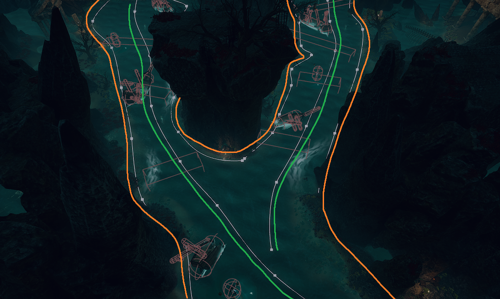

## General information

This is a group project completed at [Breda University](https://www.buas.nl/) as part of a course assignment. The goal was - **release (part of) a “presentable” game demo in cross-disciplinary teams** on a structured and known development challenge. 

> This project is finished and has a PC version available on [itch.io](https://buas.itch.io/river-tale).
{: .prompt-tip}

The idea of the game is unusual. We are using university XR stage as a game environment with custom controllers and tracking system providing a unique theme-park like experience.

## Gameplay

In this immersive multiplayer XR adventure you navigate, strategize, and communicate to defeat enemies and reach the gate to the overworld.



## Personal contribution

- I setup Jenkins for the project (automation build system)
- I setup Perforce repository (source control system)
- I setup Unreal project to use XR stage (with help of professionals)

- I established Vive tracking for physical objects used in game\
  <video class="w-100" controls>
    <source src="https://github.com/user-attachments/assets/4d002b4f-2667-4279-8eaa-c24395671e88" type="video/mp4">
  </video>
  *Video of playtesting the tracking system for the first time*

- Contributed as a game programmer
  - Guiding lines *(parallel to green)* & border lines *(parallel to orange)* for level designers.\
  *Level designers should use them to set borders of the level and guide the player in the right direction automatically.*
  
  *Example of border lines and guide lines placed in the level*

  - Ship physics
    - Smooth rotation
    - Rocking the boat on the waves
    <video class="w-100" controls>
      <source src="https://github.com/user-attachments/assets/27a7abfd-db0e-4ad3-b8ea-ccf9d817081a" type="video/mp4">
    </video>