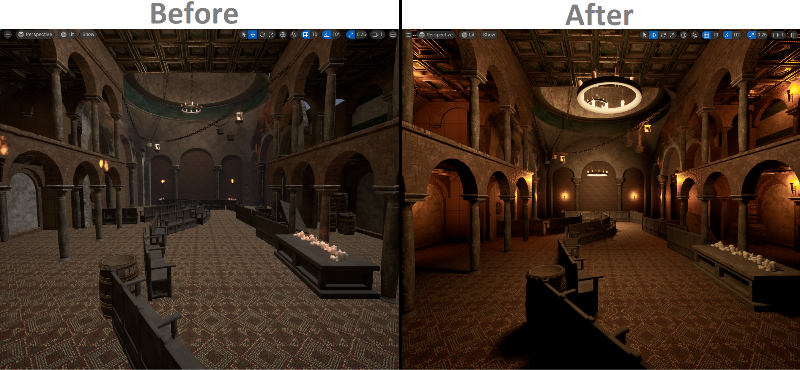

## General information

Katharsi is a puzzle adventure set in a corrupted Byzantine cathedral. With the help of your companion, you solve the puzzles blocking your path and uncover the story’s hidden truth.

The game was completed as part of my course assignment in my university. The team is constisted of 15 people.

> Check out the [<i class="fa-brands fa-steam"></i> Steam page](https://store.steampowered.com/app/3365850/Katharsi/)
{: .prompt-tip}

## Gameplay

Explore a Byzantine era cathedral which has been corrupted by the plague. Work together with your companion and solve light-based puzzles to overcome obstacles. Reveal the truth behind the plague and your companion.

> We released a demo of our game on April 13.\
> The game’s official release occurred on June 12.\
> We added extra content to the game with a June 19 update.
{: .prompt-info}



## Personal contribution

### The slime mold / goop

According to the project brief, the game takes place in a decayed cathedral. Our team chose an underground environment featuring a living slime mold to represent corruption and gloom. Interacting with the mold causes it to dissolve, serving as both a gameplay mechanic and a narrative symbol of healing.\
After the first eight weeks, all the technical artists who were intended to implement the corruption left the team, creating a major challenge for the team.\
As a result, I took full ownership of this feature - delivering a C++ plugin that enables artists to paint the mold across the environment, implementing the intended gameplay mechanics and optimizing the performance for it.

*The article below showcases and explains the plugin*



*GIF below shows the dissolving VFX of the slime mold*

### Light beam game mechanic

According to the brief, this is a Zelda‑style puzzle game built around a light beam that player can redirect. Key level elements include mirrors for reflecting the beam and sensors that react when the beam hits them.\
As a result, I implemented the gameplay mechanic.

*The video below showcases the light beam mechanic. **This video should be updated.***
<video class="w-100" controls>
  <source src="https://github.com/user-attachments/assets/64f64475-b9d2-4dfa-927e-c0c1d5ad21d3" type="video/mp4">
</video>

### Lighting and optimization

Our game's performance was terrible, and we had no lighting artists. Recently, I learned that Unreal’s Lumen is resource‑heavy and not always necessary.\
Disabling Lumen doubled performance but worsened lighting. I teamed up with the environment artist to completely revamp our lighting system.\
By turning off Lumen and overhauling the lighting, we achieved far better visual results.

*In-game lighting before and after*

*Light calculation costs before and after (White = bad; Blue = good)*
