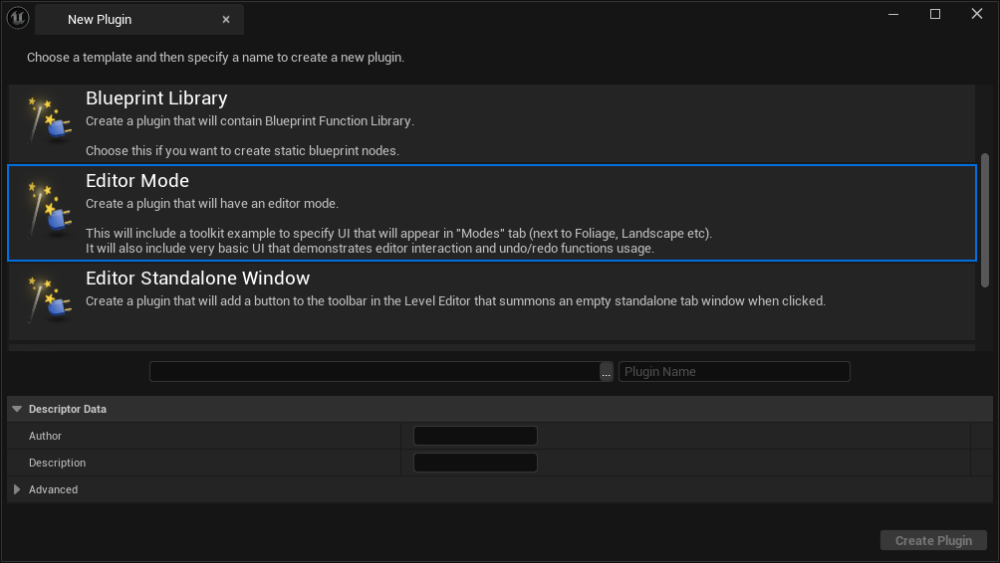
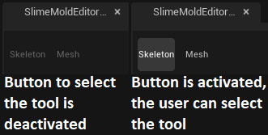
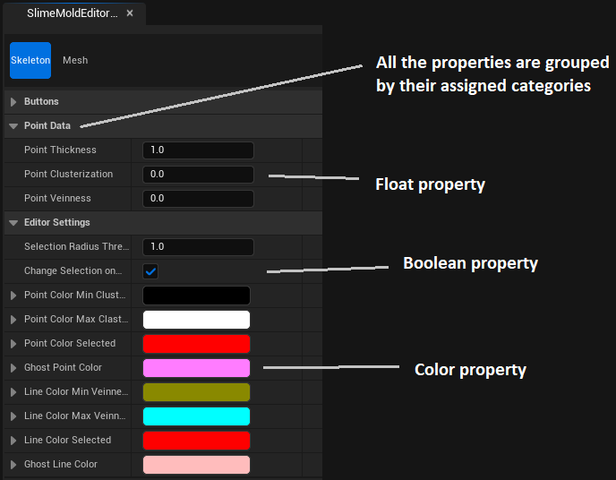
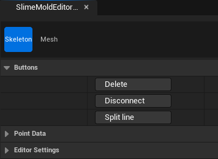
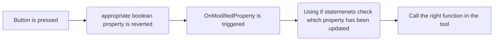

> This project is currently under development and the article is still in a draft state. Major changes are expected.
{: .prompt-danger}


## What is this all about?

My team is working on a game called [Katharsi](../Katharsi). One of my tasks was to create a tool for artists to spread the slime mold (the goop) around the game environment. In this article I will explain the plugin I created for this tool and how the generation is built on top of it.

> The source code of the plugin and this tool is available on [<i class="fab fa-github"></i> GitHub](https://github.com/SmailikHappy/SlimeMoldTool), where you can also find instructions on how to use it for you own project.
{: .prompt-tip}

<video class="w-100" controls>
  <source src="../../assets/post_data/slime_mold/beta_tool_showcase.mp4" type="video/mp4">
</video>


## Plugin

The plugin is implemented in C++ and provides:

- Actor component
  - stores skeleton data (arrays of points and lines)
  - has delegates that can be called when button is pressed
- Slime mold editor mode
  - Skeleton tool
    - add / move / delete skeleton points
    - connect / disconnect skeleton points with lines
    - edit point data (e.g. thickness)
  - Mesh tool
    - edit custom properties
    - buttons to call delegates (e.g. generate mesh)
- Custom property base class for mesh tool
  - to instantiate and create custom properties for the mesh tool


## Working pipeline

### Preparation

1. The user has to create an actor and attach the actor component to it.
2. The actor component has 4 delegates (`GenerateMesh`, `GenerateDebugInfo`, `AssignMaterials`, `ClearMesh`) that can be used in the owning actor blueprint graph. The user has full control over how these events will be handled in blueprints, so they can create their own generation algorithms based on their needs. Additionally, it is up to the user to implement the actual functionality for these events.
3. The skeleton data stored in the component can be accessed and retrieved from blueprints. It was inteded to use this data in generation algorithm.
4. Most probably, the user will find it useful to have some more input variables for generation to have more control. So that, the user can create a custom object instatiated from `USlimeMoldMeshPropertyBase` and define variables there.

### Editor mode usage

- The user will utilize the skeleton tool to manage the skeleton. They can move, add, delete, connect, and disconnect points, as well as edit the data stored in points.
- The user will use the mesh tool for mesh generation. They can modify custom properties and when the user presses the button, these properties are passed to the owning actor's blueprint graph.

> The tool is so flexible that the user can implement their own generation algorithms just using blueprints. The user has full control over custom properties and buttons.\
> Interestingly, the user does not have to generated anything, they can use the skeleton data for their own purposes in runtime, as the skeleton data is always saved and even available in the final game build. 
{: .prompt-info}

*Showcase of the full tool usage:*

<video class="w-100" controls>
  <source src="../../assets/post_data/slime_mold/full_tool_usage.mp4" type="video/mp4">
</video>

---

> The whole text below requires significant reordering.
{: .prompt-danger}

---

## Actor component

The actor component stores arrays of points and lines that represent the skeleton of the slime mold.
This component has 4 delegates that can be called when the associated button in mesh tool is pressed. The user has to use them as events in an owning actor blueprint graph. Input for the delegates are user's custom properties.

```c++
DECLARE_DYNAMIC_MULTICAST_DELEGATE_OneParam(FGenerateMeshEvent, UObject*, Properties);
DECLARE_DYNAMIC_MULTICAST_DELEGATE_OneParam(FGenerateDebugInfoEvent, UObject*, Properties);
DECLARE_DYNAMIC_MULTICAST_DELEGATE_OneParam(FAssignMaterials, UObject*, Properties);
DECLARE_DYNAMIC_MULTICAST_DELEGATE_OneParam(FClearMesh, UObject*, Properties);

UCLASS(BlueprintType, Blueprintable, meta = (BlueprintSpawnableComponent))
class SLIMEMOLD_API USlimeMoldSkeletonComponent : public UActorComponent
{
	GENERATED_BODY()

public:

	UPROPERTY(EditAnywhere, BlueprintReadWrite, SaveGame)
	TArray<FSkeletonPoint> SkeletonPoints;

	UPROPERTY(EditAnywhere, BlueprintReadWrite, SaveGame)
	TArray<FSkeletonLine> SkeletonLines;


	// GenerateMesh button triggers this event
	UPROPERTY(BlueprintAssignable, EditDefaultsOnly)
	FGenerateMeshEvent OnGenerateMesh;

	// GenerateDebugInfo button triggers this event
	UPROPERTY(BlueprintAssignable, EditDefaultsOnly)
	FGenerateDebugInfoEvent OnGenerateDebugInfo;

	// AssignMaterials button triggers this event
	UPROPERTY(BlueprintAssignable, EditDefaultsOnly)
	FAssignMaterials OnAssignMaterials;

	// ClearMesh button triggers this event
	UPROPERTY(BlueprintAssignable, EditDefaultsOnly)
	FClearMesh OnClearMesh;
};
```

### Skeleton data structure

From the code sample above, you saw that the actor component stores 2 arrays of `FSkeletonPoint` and `FSkeletonLine`. These are 2 structures that represent the point and line

#### FSkeletonPoint

`Thickness`, `Clusterization` and `Veinness` are custom data that is stored per point.

```c++
USTRUCT(Blueprintable, BlueprintType)
struct SLIMEMOLD_API FSkeletonPoint
{
	GENERATED_BODY()

	UPROPERTY(EditAnywhere, BlueprintReadWrite)
	FVector WorldPos = FVector::ZeroVector;

	UPROPERTY(EditAnywhere, BlueprintReadWrite)
	float Thickness = 1.0f;

	UPROPERTY(EditAnywhere, BlueprintReadWrite)
	float Clusterization = 0.0f;

	UPROPERTY(EditAnywhere, BlueprintReadWrite)
	float Veinness = 0.0f;
};
```

#### FSkeletonLine

`Point1ID` and `Point2ID` are indices of the points in the `FSkeletonPoints` array of the actor component that owns the line. Ideally, we would like to simply store a pointer or reference to the point object, but Unreal does not allow creating pointers to UStructs and it is impossible to store references in an array *(or I simply don't know how)*.

```c++
USTRUCT(BlueprintType)
struct SLIMEMOLD_API FSkeletonLine
{
	GENERATED_BODY()

	FSkeletonLine() {}
	FSkeletonLine(int32 i, int32 j) : Point1ID(i), Point2ID(j) {}

	UPROPERTY(EditAnywhere, BlueprintReadWrite)
	int32 Point1ID = -1;

	UPROPERTY(EditAnywhere, BlueprintReadWrite)
	int32 Point2ID = -1;

	bool operator==(const FSkeletonLine& Other) const
	{
		return (this->Point1ID == Other.Point1ID && this->Point2ID == Other.Point2ID)
			|| (this->Point1ID == Other.Point2ID && this->Point2ID == Other.Point1ID);
	}
};
```


## Slime mold editor mode

### Interactive Tools Framework

The whole editor mode is based on the Interactive Tools Framework (further ITF).

> There is [a nice tutorial](https://www.gradientspace.com/tutorials/2021/01/19/the-interactive-tools-framework-in-ue426) from Ryan Schmidt (an employee of Epic Games) explaining details and usage of ITF.
{: .prompt-info}

This plugin introduces a custom editor mode [`/Plugins/SlimeMold/Source/SlimeMoldEditorTool/Public/`{: .filepath}](https://github.com/SmailikHappy/SlimeMoldTool/tree/main/Plugins/SlimeMold/Source/SlimeMoldEditorTool/Public)\
with skeleton tool [`/Plugins/SlimeMold/Source/SlimeMoldEditorTool/Tools/SkeletonEditing`{: .filepath}](https://github.com/SmailikHappy/SlimeMoldTool/tree/main/Plugins/SlimeMold/Source/SlimeMoldEditorTool/Tools/SkeletonEditing)\
and mesh tool [`/Plugins/SlimeMold/Source/SlimeMoldEditorTool/Tools/MeshEditing`{: .filepath}](https://github.com/SmailikHappy/SlimeMoldTool/tree/main/Plugins/SlimeMold/Source/SlimeMoldEditorTool/Tools/MeshEditing).

> The links above point to the folders containing the source code in the [<i class="fab fa-github"></i> GitHub repository](https://github.com/SmailikHappy/SlimeMoldTool) of this plugin.

> All custom-editor-mode files are auto-generated by Unreal when creating a plugin with a template shown on the image below.\
> 
>
> Template will create `EditorMode`, `ModeCommands`, `ModeToolkit` and `Module` classes.\
> All of these classes are essential for the editor mode to work. Comments within those files provide explanations of their purpose and how to use them, so I won't dive deeper into them here.
{: .prompt-tip}


## Skeleton tool

Using this tool the user can:
- add / move / delete points
- connect / disconnect points
- edit point data (thickness, clusterization, veinness)

### Tool builder

The tool builder is responsible for creating tool instances and controlling whether a tool can be initialized or not.

- `CanBuildTool()` - determines whether the tool can be activated / used by the user.\
  *In my case, the tool can be used only when an actor with a [Slime mold actor component](#actor-component) is selected.*\
  {: .w-100 .justify-content-center}
- `BuildTool()` - creates the tool instance and calls some initialization code. Function is called when the button shown above is pressed.\
  *In my case, I am creating a tool object and passing the world instance.*

```c++
UCLASS()
class SLIMEMOLDEDITORTOOL_API USlimeMoldSkeletonEditingToolBuilder : public UInteractiveToolBuilder
{
	GENERATED_BODY()

public:
	virtual bool CanBuildTool(const FToolBuilderState& SceneState) const override;
	virtual UInteractiveTool* BuildTool(const FToolBuilderState& SceneState) const override;
};
```
{: file='SlimeMoldSkeletonEditingTool.h'}

```c++
bool USlimeMoldSkeletonEditingToolBuilder::CanBuildTool(const FToolBuilderState& SceneState) const
{
	return USlimeMoldEditorFuncLib::SingleActorWithSkeletonComponentIsSelected();
}

UInteractiveTool* USlimeMoldSkeletonEditingToolBuilder::BuildTool(const FToolBuilderState& SceneState) const
{
	USlimeMoldSkeletonEditingTool* NewTool = NewObject<USlimeMoldSkeletonEditingTool>(SceneState.ToolManager);
	NewTool->SetWorld(SceneState.World);
	return NewTool;
}
```
{: file='SlimeMoldSkeletonEditingTool.cpp'}

### Tool class

This class handles the whole main behavior of the tool. All the logic to operate on skeleton data, mouse input, rendering and property data is here.

```c++
UCLASS()
class SLIMEMOLDEDITORTOOL_API USlimeMoldSkeletonEditingTool : public UInteractiveTool, public IHoverBehaviorTarget, public IClickDragBehaviorTarget
{
	GENERATED_BODY()

public:
	virtual void SetWorld(UWorld* World);

	/** UInteractiveTool overrides */
	void Setup() override;
	void OnPropertyModified(UObject* PropertySet, FProperty* Property) override;
	void Shutdown(EToolShutdownType ShutdownType) override;
	void Render(IToolsContextRenderAPI* RenderAPI) override;
	void OnTick(float DeltaTime) override;

	/** IModifierToggleBehaviorTarget implementation */
	void OnUpdateModifierState(int ModifierID, bool bIsOn) override; 

	/** IHoverBehaviorTarget implementation */
	FInputRayHit BeginHoverSequenceHitTest(const FInputDeviceRay& PressPos) override { return MouseHittingWorld(PressPos); };
	void OnBeginHover(const FInputDeviceRay& ClickPos) override {};
	void OnEndHover() override {};
	bool OnUpdateHover(const FInputDeviceRay& DevicePos) override { MouseUpdate(DevicePos); return true; };

	/** IClickDragBehaviorTarget implementation */
	FInputRayHit CanBeginClickDragSequence(const FInputDeviceRay& PressPos) override { return MouseHittingWorld(PressPos); };
	void OnClickPress(const FInputDeviceRay& PressPos) override { MouseRayWhenPressed = PressPos; MouseIsPressed = true; MousePressed(); };
	void OnClickDrag(const FInputDeviceRay& DragPos) override { MouseUpdate(DragPos); };
	void OnClickRelease(const FInputDeviceRay& ReleasePos) override { MouseRayWhenReleased = ReleasePos; MouseIsPressed = false; MouseReleased(); };
	void OnTerminateDragSequence() override {};

...

protected:

	UPROPERTY()
	UWorld* TargetWorld = nullptr;
	
	UPROPERTY()
	USlimeMoldSkeletonComponent* TargetActorComponent = nullptr;
};
```
{: file='SlimeMoldSkeletonEditingTool.h'}

> Some functions were not shown in the sample above. These are either self-explanatory or were created to improve the code structure.\
> The whole code is available here: [SlimeMoldSkeletonEditingTool.h](https://github.com/SmailikHappy/SlimeMoldTool/blob/8d19616de394268cf34347917b82f64f492a05d0/Plugins/SlimeMold/Source/SlimeMoldEditorTool/Tools/SkeletonEditing/SlimeMoldSkeletonEditingTool.h) and [SlimeMoldSkeletonEditingTool.cpp](https://github.com/SmailikHappy/SlimeMoldTool/blob/8d19616de394268cf34347917b82f64f492a05d0/Plugins/SlimeMold/Source/SlimeMoldEditorTool/Tools/SkeletonEditing/SlimeMoldSkeletonEditingTool.cpp).
{: .prompt-info}

#### UInteractiveTool class

It is a base class for any tool in Unreal. It has these virtual functions:

- `Setup()` - this function is responsible for initializing the tool *([link to the sample](https://github.com/SmailikHappy/SlimeMoldTool/blob/8d19616de394268cf34347917b82f64f492a05d0/Plugins/SlimeMold/Source/SlimeMoldEditorTool/Tools/SkeletonEditing/SlimeMoldSkeletonEditingTool.cpp#L51-L86))*. Here's what it does:
  - Sets up input listeners to handle user interactions
  - Creates a gizmo for manipulating points
  - Initializes, restores, and attaches properties to the tool
  - Links the customization class to the property UI
- `OnPropertyModified()` - called when a property in the UI is modified *([link to the sample](https://github.com/SmailikHappy/SlimeMoldTool/blob/8d19616de394268cf34347917b82f64f492a05d0/Plugins/SlimeMold/Source/SlimeMoldEditorTool/Tools/SkeletonEditing/SlimeMoldSkeletonEditingTool.cpp#L94-L146))*. In this function, I am doing:
  - Checking if the user changed the point data in the UI. If so, I update the point data with the one the user just set.
  - Checking if any of the buttons were pressed. If so, I call the corresponding function. *(Check section [Button workaround](#button-workaround) for more details)*
- `Shutdown()` - cleanup code *([link to the sample](https://github.com/SmailikHappy/SlimeMoldTool/blob/8d19616de394268cf34347917b82f64f492a05d0/Plugins/SlimeMold/Source/SlimeMoldEditorTool/Tools/SkeletonEditing/SlimeMoldSkeletonEditingTool.cpp#L148-L152))*. My actions:
  - Chaching property values for the next time
  - Destroying gizmos
- `Render()` - render tick function *([link to the sample](https://github.com/SmailikHappy/SlimeMoldTool/blob/8d19616de394268cf34347917b82f64f492a05d0/Plugins/SlimeMold/Source/SlimeMoldEditorTool/Tools/SkeletonEditing/SlimeMoldSkeletonEditingTool.cpp#L659-L707))*. Explanation of my code:
  - Drawing ghost points and ghost lines *(by ghost object I mean potential points and lines that will be created if the user presses left mouse button)*
  - Drawing all the lines
  - Drawing all the points
  - The code uses Unreal debug drawing
- `OnTick()` - this is the tick function *([link to the sample](https://github.com/SmailikHappy/SlimeMoldTool/blob/8d19616de394268cf34347917b82f64f492a05d0/Plugins/SlimeMold/Source/SlimeMoldEditorTool/Tools/SkeletonEditing/SlimeMoldSkeletonEditingTool.cpp#L709-L725))*. In this function:
  - I check if the selected actor is the same as the one the tool is currently operating on. If a different actor with a skeleton component is selected, the tool reloads with the new data. If a non-compatible actor or no actor is selected, the tool shuts down.

#### Input interfaces

- **IHoverBehaviorTarget** - `OnBeginHover()`, `OnEndHover()`, `OnUpdateHover()`\
  Using these functions, I am handling the mouse input information when none buttons are pressed.
- **IClickDragBehaviorTarget** - `OnClickPress()`, `OnClickDrag()`, `OnClickRelease()`, `OnTerminateDragSequence()`\
  Using these functions, I am handling the mouse input information when left mouse button is pressed, held or released.
- **IModifierToggleBehaviorTarget** - `OnModifierToggle()`\
  This interface has a single listener function that listens if modifier keys (<kbd>Ctrl</kbd> or <kbd>Shift</kbd> in my case) change their state.

In my code, I narrow down the input functions into 3 main ones `MousePressed()`, `MouseUpdate()` & `MouseReleased()` and 3 boolean variables `MouseIsPressed`, `ShiftIsPressed` & `CtrlIsPressed`. 

From this [code sample](https://github.com/SmailikHappy/SlimeMoldTool/blob/8d19616de394268cf34347917b82f64f492a05d0/Plugins/SlimeMold/Source/SlimeMoldEditorTool/Tools/SkeletonEditing/SlimeMoldSkeletonEditingTool.cpp#L157-L281) you can see that I am binding the mouse events and key states to execute a specific functions like `CreatePoint()`, `SelectPoint()`, `ConnectPoints()` and etc. 

### Tool property set
The property set is a class with variables exposed in the tool's UI.

{: .w-100 .justify-content-center}

```c++
UCLASS(Config = EditorPerProjectUserSettings)
class SLIMEMOLDEDITORTOOL_API USlimeMoldSkeletonEditingToolProperties : public UInteractiveToolPropertySet
{
	GENERATED_BODY()

public:
	USlimeMoldSkeletonEditingToolProperties() {}

	/** Point thickness of the of the main vein */
	UPROPERTY(BlueprintReadWrite, EditAnywhere, Category = "Point data")
	float PointThickness = 1.0f;

	/** The amount of clusters (not a number) to generate from the line with this point */
	UPROPERTY(BlueprintReadWrite, EditAnywhere, Category = "Point data")
	float PointClusterization = 0.0f;

	/** Value that corresponds to vein producing */
	UPROPERTY(BlueprintReadWrite, EditAnywhere, Category = "Point data")
	float PointVeinness = 0.0f;

#pragma region Buttons
	...
#pragma endregion

#pragma region EditorSettings
	...
#pragma endregion
};
```
{: file='SlimeMoldSkeletonEditingTool.h'}

As mentioned in the [UInteractiveTool section above](#uinteractivetool-class), we create and attach property sets when initializing the tool. The developer can add as many properties as they want.\
The `RestoreProperties()` function loads the property data from the cache if the `SaveProperties()` function was called earlier in the same Unreal session.\
*Snippet from tool `Setup()` function:*

```c++
	Properties = NewObject<USlimeMoldSkeletonEditingToolProperties>(this);
	AddToolPropertySource(Properties);

	Properties->RestoreProperties(this, "Skeleton properties");
```
{: file='SlimeMoldSkeletonEditingTool.cpp'}


#### Customization class

It is not possible to create a button or any other UI element except for variables with just a property set. Unreal provides customization classes that can be used to create custom UI elements like buttons, text-blocks or re-order, re-structure and re-arrange any UI elements.
The code below registers a customization class for the property set, which is executed when the property set is attached to the tool.
```c++
	FPropertyEditorModule& PropertyModule = FModuleManager::LoadModuleChecked<FPropertyEditorModule>("PropertyEditor");

	PropertyModule.RegisterCustomClassLayout(
		USlimeMoldSkeletonEditingToolProperties::StaticClass()->GetFName(),
		FOnGetDetailCustomizationInstance::CreateStatic(&FSlimeMoldSkeletonEditingCustomization::MakeInstance)
	);
```
{: file='SlimeMoldSkeletonEditingTool.cpp'}


The [customization class](https://github.com/SmailikHappy/SlimeMoldTool/blob/8d19616de394268cf34347917b82f64f492a05d0/Plugins/SlimeMold/Source/SlimeMoldEditorTool/Tools/SkeletonEditing/SlimeMoldSkeletonEditingCustomization.h) has function `CustomizeDetails()` where all the UI magic should happen.

In the [code sample](https://github.com/SmailikHappy/SlimeMoldTool/blob/8d19616de394268cf34347917b82f64f492a05d0/Plugins/SlimeMold/Source/SlimeMoldEditorTool/Tools/SkeletonEditing/SlimeMoldSkeletonEditingCustomization.cpp#L19-L90) of the `CustomizeDetails()` function, I create button UI elements and hide the boolean variables from the panel. The code creates 3 buttons in the property panel of the tool:

{: .w-100 .justify-content-center}

> You may have noticed that the only functionality that the button has is to toggle the boolean property. This is a workaround to pass button press events to the tool, check the section [Button workaround](#button-workaround) for more details.
{: .prompt-warning}

#### Button workaround

Regrettably, there is no direct method to relay the button press event to the tool since the customization class is not aware of the tool class. However, both the customization and tool classes can access the property set object. It means that when the button modifies a specific property value, the `OnPropertyModified()` function is triggered in the tool class.



Code from customization class (`CustomizeDetails()` function):

```c++
SNew(SButton)
	.Text(FText::FromString("Delete"))
	.OnClicked(FOnClicked::CreateLambda([DeletePointsButton]()
	{
		bool bValue = false;
		DeletePointsButton->GetValue(bValue);
		DeletePointsButton->SetValue(!bValue);

		return FReply::Handled();
	}))
```
{: file='SlimeMoldSkeletonEditingCustomization.cpp'}

Code from tool class (`OnModifiedProperty()` function):

```c++
// Buttons
{
	// "Delete points" button pressed
	if (Property->GetName() == "bDeletePoints")
	{
		DeleteSelectedPoints();
	}
	// "Disconnect points" button pressed
	else if (Property->GetName() == "bDisconnectPoints")
	{
		DisconnectSelectedPoints();
	}
	// "Split the line" button pressed
	else if (Property->GetName() == "bSplitLine")
	{
		TArray<FSkeletonLine> SelectedLines = GetSelectedLines();

		for (FSkeletonLine LineToSplit : SelectedLines)
		{
			SplitLine(LineToSplit);
		}
	}
}
```
{: file='SlimeMoldSkeletonEditingTool.cpp'}


## Mesh tool

Using this tool the user can:
- add / change custom properties
- press buttons to call delegates in the selected actor

### Tool builder

> The tool builder is the same as the skeleton tool builder, but it creates an instance of the mesh tool instead of the skeleton tool. For more information, see the [tool builder](#tool-builder) section of the skeleton tool.
{: .prompt-info}

### Tool class

This class handles the whole main behavior of the tool. Mesh tool is intended to serve as a control panel for mesh generation, where the user can adjust some variables and simply press <kbd>buttons</kbd>.

```c++
UCLASS()
class SLIMEMOLDEDITORTOOL_API USlimeMoldMeshEditingTool : public UInteractiveTool
{
	GENERATED_BODY()

public:
	virtual void SetWorld(UWorld* World);

	/** UInteractiveTool overrides */
	void Setup() override;
	void OnPropertyModified(UObject* PropertySet, FProperty* Property) override;
	void Shutdown(EToolShutdownType ShutdownType) override;
	void OnTick(float DeltaTime) override;

protected:

	/** Tool properties */
	UPROPERTY()
	TObjectPtr<USlimeMoldMeshEditingToolProperties> ToolProperties;

	/** Mesh properties */
	UPROPERTY()
	TObjectPtr<USlimeMoldMeshPropertyBase> MeshProperties;

protected:

	UPROPERTY()
	UWorld* TargetWorld = nullptr;		// target World we will raycast into

	UPROPERTY()
	USlimeMoldSkeletonComponent* TargetActorComponent = nullptr;
};
```

#### Functions

> `Setup()`, `OnPropertyModified()`, `Shutdown()`, `OnTick()` are virtual functions inherited from `UInteractiveTool`. Check the [UInteractive tool](#uinteractivetool-class) section of skeleton tool for more information.
{: .prompt-info}

Here is what I am doing in these functions:

- `Setup()` *([link to the code](https://github.com/SmailikHappy/SlimeMoldTool/blob/8d19616de394268cf34347917b82f64f492a05d0/Plugins/SlimeMold/Source/SlimeMoldEditorTool/Tools/MeshEditing/SlimeMoldMeshEditingTool.cpp#L38-L72))*
  - Creating, restoring and attaching the tool properties. Extra applying customization for these properties.
  - Creating, restoring and attaching custom properties that the user has selected.
- `OnPropertyModified()` *([link to the code](https://github.com/SmailikHappy/SlimeMoldTool/blob/8d19616de394268cf34347917b82f64f492a05d0/Plugins/SlimeMold/Source/SlimeMoldEditorTool/Tools/MeshEditing/SlimeMoldMeshEditingTool.cpp#L103-L169))*
  - Checking if the user selected a custom property set class. If so, the tool is reloaded and custom properties will be attached to the UI.
  - Checking if any of the buttons were pressed. If so, I call the corresponding function. *(Check section [Button workaround](#button-workaround) for more details)*
- `Shutdown()` *([link to the code](https://github.com/SmailikHappy/SlimeMoldTool/blob/8d19616de394268cf34347917b82f64f492a05d0/Plugins/SlimeMold/Source/SlimeMoldEditorTool/Tools/MeshEditing/SlimeMoldMeshEditingTool.cpp#L171-L177))*
  - Caching the properties for the next time
- `OnTick()` *([link to the code](https://github.com/SmailikHappy/SlimeMoldTool/blob/8d19616de394268cf34347917b82f64f492a05d0/Plugins/SlimeMold/Source/SlimeMoldEditorTool/Tools/MeshEditing/SlimeMoldMeshEditingTool.cpp#L179-L195))*
  - I check if the selected actor is the same as the one the tool is currently operating on. If a different actor with a skeleton component is selected, the tool reloads with the new data. If a non-compatible actor or no actor is selected, the tool shuts down.

### Tool properties

This tool has two property set classes:
- `USlimeMoldMeshEditingToolProperties` - the tool properties, which include button booleans and a special property where the user can select a custom property set class

```c++
UCLASS(Config = EditorPerProjectUserSettings)
class SLIMEMOLDEDITORTOOL_API USlimeMoldMeshEditingToolProperties : public UInteractiveToolPropertySet
{
	GENERATED_BODY()

public:
	USlimeMoldMeshEditingToolProperties() {}

	UPROPERTY(EditAnywhere, Category = "Button")
	bool bGenerateMesh = false;


	UPROPERTY(EditAnywhere, Category = "Button")
	bool bGenerateDebugInfo = false;

	UPROPERTY(EditAnywhere, Category = "Button")
	bool bAssignMaterials = false;

	UPROPERTY(EditAnywhere, Category = "Button")
	bool bClearMesh = false;

	// Custom property set that will be passed via delegates
	UPROPERTY(EditAnywhere, Category = "Default")
	TSubclassOf<USlimeMoldMeshPropertyBase> MeshPropertyClass;
};
```
- `USlimeMoldMeshPropertyBase` - a base class that a user must inherit from when creating a custom property set. It is completely empty.

```c++
UCLASS(Transient, Blueprintable)
class SLIMEMOLDEDITORTOOL_API USlimeMoldMeshPropertyBase : public UInteractiveToolPropertySet
{
	GENERATED_BODY()

public:
	USlimeMoldMeshPropertyBase() {} 
};
```


## Generation algorithm

### References


This is the main reference - fungus that is growing over surfaces.\
The main game's reference is [The Last of Us fungus](https://thelastofus.fandom.com/wiki/Cordyceps_brain_infection).

### Unreal Geometry Script

I have used [Geometry Script](https://dev.epicgames.com/documentation/en-us/unreal-engine/geometry-scripting-users-guide-in-unreal-engine) plugin to generate the mesh. It is very similar to blender geometry nodes.

> The generation algorithm is not completely done yet.
{: .prompt-danger}


